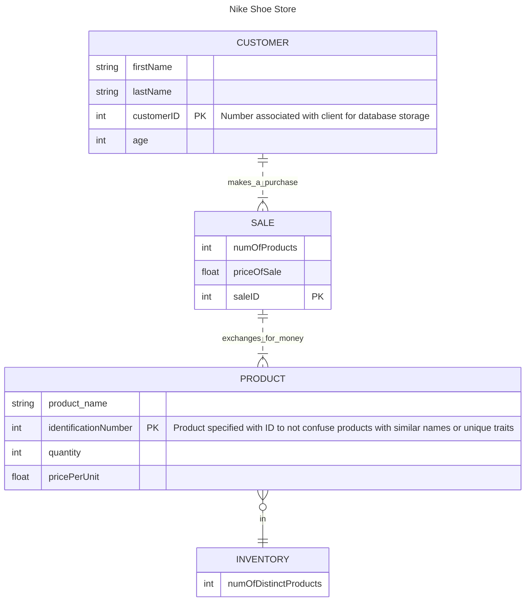

### Diagram Description
Contained within this diagram is a brief picture into the categories of change at  
the Nike store. Operations for the store trickle up from the inventory first. The  
inventory will have the numbers of products so that managers can keep track of which  
products are selling and how rapidly. This will give datapoints to keep popular models  
of shoes in stock as opposed to those that sit on shelves without being purchased often.  
The inventory is divided up into individual products that customers obtain through a sale.  
The products have unique identifiers to separate one product from another and so that records  
can be kept as to which is more popular. Sales must be kept as well to identify trends  
in purchases to associate specific products being purchased as a group. This will advise  
the Nike store to potential bundle deals they can provide to attract larger purchases  
on visitors who may not intend to buy more but given a deal are more willing to participate.  
The customer information is important to acquire for similar data points to be obtained.  
The process is straightforward, but put simply a customer is required to make a sale. A sale is  
an exchange of product(s) for currency. Products are ordered and counted within the inventory  
to be prepared for future potential sales.
