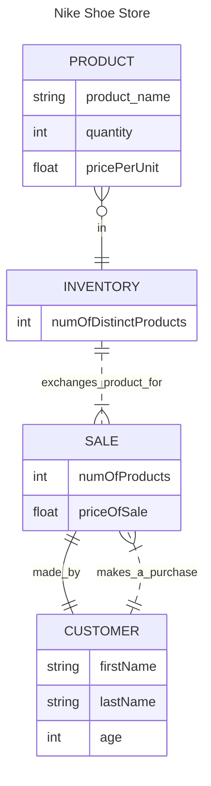

```mermaid
---
title: Nike Shoe Store
---
erDiagram

  PRODUCT {
    string product_name
    int quantity
    float pricePerUnit
  }
 
  CUSTOMER {
    string firstName
    string lastName
    int age
  }
  
  SALE {
    int numOfProducts
    float priceOfSale
  }
  
  INVENTORY {
    int numOfDistinctProducts
    
  }
  CUSTOMER ||..|{ SALE : makes_a_purchase
  INVENTORY ||..|{ SALE : exchanges_product_for
  PRODUCT }o--||INVENTORY : in
  SALE ||--|| CUSTOMER : made_by
```
