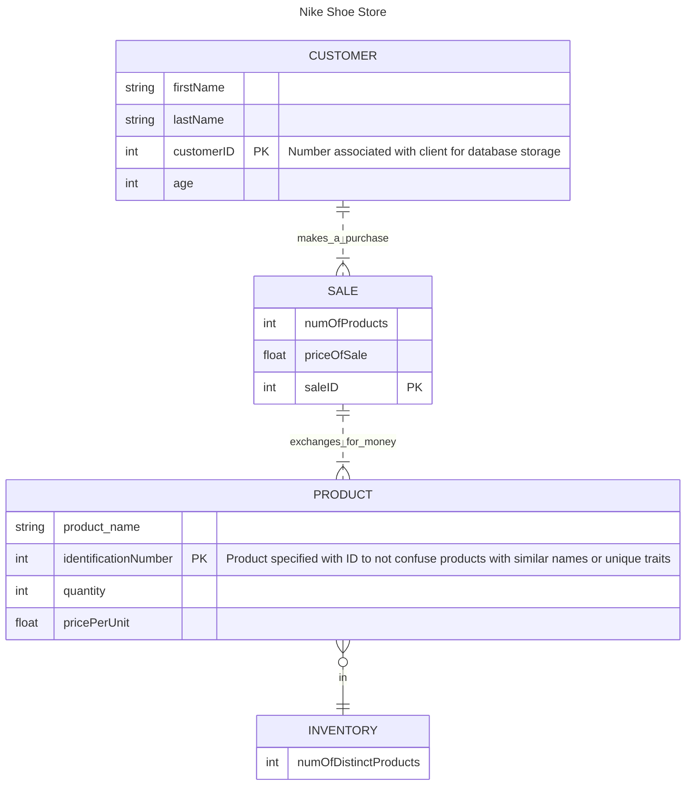

```mermaid
---
title: Nike Shoe Store
---
erDiagram

  PRODUCT {
    string product_name
    int identificationNumber PK "Product specified with ID to not confuse products with similar names or unique traits"
    int quantity
    float pricePerUnit
  }
 
  CUSTOMER {
    string firstName
    string lastName
    int customerID PK "Number associated with client for database storage"
    int age
  }
  
  SALE {
    int numOfProducts
    float priceOfSale
    int saleID PK
  }
  
  INVENTORY {
    int numOfDistinctProducts
    
  }
  CUSTOMER ||..|{ SALE : makes_a_purchase
  PRODUCT }o--||INVENTORY : in
  SALE ||..|{ PRODUCT : exchanges_for_money
```
